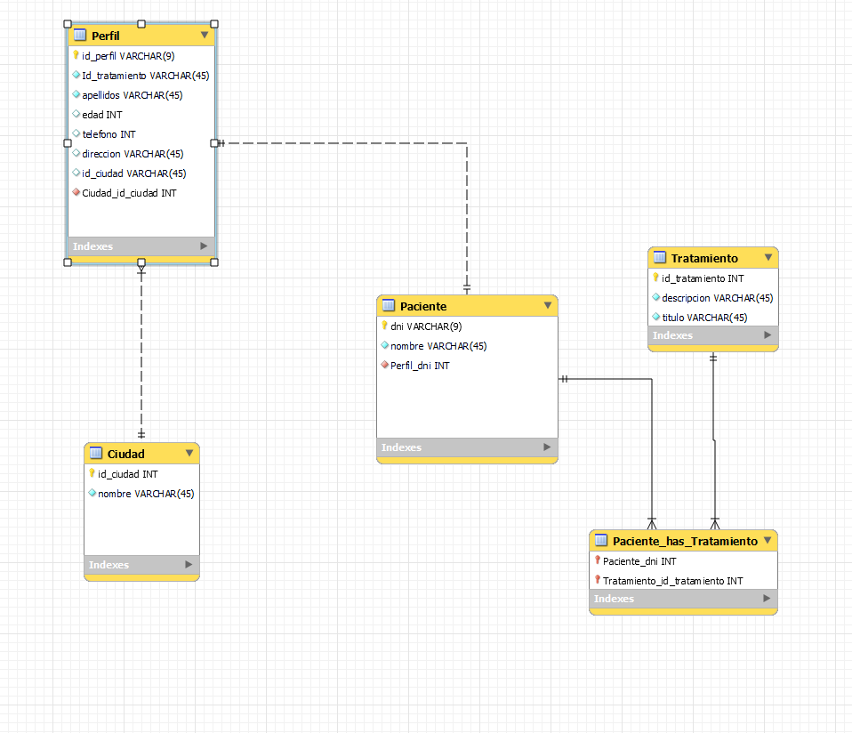

# SMILE
## MAIN STAGE
A dental clinic requests a REST API so that its future mobile application, as well as the frontend of its Web App (currently under construction with the VUE.js framework), can consume the data stored in a MySQL database, which It is already available in the hosting they have contracted.
Requirements:
- They need to list, add, modify and delete patients.
- Each patient should have a profile.
- The api must provide access to said profile, as well as create it, modify it and, if a patient unsubscribes, it must be deleted.
- It must be possible to access a patient's data through their ID.
- Finally, the api must provide the treatments carried out on each patient.
Required and mandatory data regarding the patient:
- name
- surnames
- age
- telephone contact
- Home address
- city of residence
## PROYECT PARTS
### Design of the DDBB
  
Attending to the minimum required, we develop the structure of the DDBB (tables and their relationships between them).
### Development of the logical part
Taking into account the minimum requirements, and starting from the structure of the DDBB created, we proceeded to develop the logic of our REST API. For this, and according to the MVC methodology, we develop the different models, controllers and services, as well as the connections and relations to the aforementioned DDBB.

### Languages:
- JAVA
- MySQL
### Frameworks and Dependencies:
- Spring boot
- Spring Boot DevTools
- Spring Web
- MySQL Driver
- Spring Data JPA
### Tools:
- Visual Studio Code
- GitHub
- XAMPP
- MySQL server
- MsSQL Workbench
- Postman
## Team:
- [@drdaza](https://github.com/drdaza)
- [@JohnnyRamirezSancho](https://github.com/JohnnyRamirezSancho)

# Getting Started

### Reference Documentation
For further reference, please consider the following sections:

* [Official Apache Maven documentation](https://maven.apache.org/guides/index.html)
* [Spring Boot Maven Plugin Reference Guide](https://docs.spring.io/spring-boot/docs/2.7.8/maven-plugin/reference/html/)
* [Create an OCI image](https://docs.spring.io/spring-boot/docs/2.7.8/maven-plugin/reference/html/#build-image)
* [Spring Boot DevTools](https://docs.spring.io/spring-boot/docs/2.7.8/reference/htmlsingle/#using.devtools)
* [Spring Web](https://docs.spring.io/spring-boot/docs/2.7.8/reference/htmlsingle/#web)
* [Spring Data JPA](https://docs.spring.io/spring-boot/docs/2.7.8/reference/htmlsingle/#data.sql.jpa-and-spring-data)

### Guides
The following guides illustrate how to use some features concretely:

* [Building a RESTful Web Service](https://spring.io/guides/gs/rest-service/)
* [Serving Web Content with Spring MVC](https://spring.io/guides/gs/serving-web-content/)
* [Building REST services with Spring](https://spring.io/guides/tutorials/rest/)
* [Accessing Data with JPA](https://spring.io/guides/gs/accessing-data-jpa/)
* [Accessing data with MySQL](https://spring.io/guides/gs/accessing-data-mysql/)

